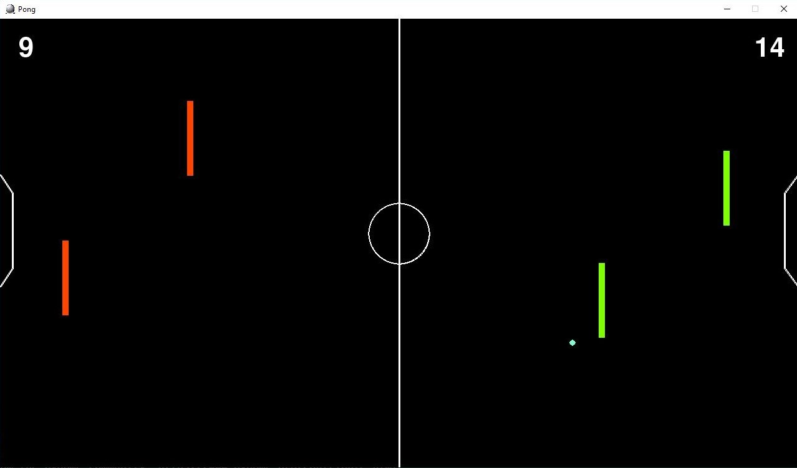

# foosPong-repo
Just a game I made in my introductory CS class.  
Battle it out with your friend. Hitting their side of the wall gives 1 point, hitting their goal gives 2.   
First person to reach 18 points wins. 

Controls:  
a,q = first left paddle  
d,e = second left paddle  
j,i = first right paddle  
l,p = second right paddle  

  

Built with Pygame 1.9.6.
